## 一、Classic detection model

### 1.Proposal or not

#### 1.1 One-stage

**OverFeat(ICLR,2014)——>YOLOv1(CVPR,2016)——>SSD(ECCV,2016)——>DSSD(Arxiv,2017)——>YOLOv2(CVPR,2017)——>RetinaNet(ICCV,2017)——>DSOD(ICCV,2017)——>YOLOv3(Arxiv,2018)——>RefineDet(ICCV,2018)——>RFBNet(ECCV,2018)——>M2Det(AAAI,2019)——>Consistent Optimization(12)**

#### 1.2 Two-stage

**RCNN(CVPR,2013)——>SPPNet(ECCV,2014)——>Fast RCNN(ICCV,2015)——>Faster RCNN(NIPS,2015)——>OHEM(CVPR,2016)——>R-FCN(NIPS,2016)——>FPN(CVPR,2017)——>DCN(ICCV,2017)——>Mask RCNN(ICCV,2017)——>Soft-NMS(ICCV, 2017)——>Cascade R-CNN(CVPR,2018)——>IoUNet(ECCV 2018)——>TrindentNet(13)**

#### 1.3 One-Two Combination

**RefineDet(ICCV,2018)**

### 2.Improvement of detection modules

#### 2.1 based RPN

[MR-CNN]

[FPN]

[CRAFT]

[R-CNN for Small Object Detection]

#### 2.2 based ROI

[RFCN]

[CoupleNet]

[Mask R-CNN]

[Cascade R-CNN]

#### 2.3 based NMS

**[Soft-NMS(ICCV,2017)]**

[Softer-NMS]

[ConvNMS]

[Pure NMS Network]

[Fitness NMS]

#### 2.4 based anchor

[GA-RPN(CVPR2019)]

### 3.Improvement to solve problems

#### 3.1 small object

1. data-augmentation。简单粗暴有效，正确的做sampling可以很大提升模型在小物体检测上的性能。这里面其实trick也蛮多的，可以参考pyramidbox里面的data-anchor-sampling。

针对MaskRCNN做数据增强，人工随机在图像中复制小物体，提高anchor的命中率

2. 特征融合方法。最简单粗暴有效的方法，但是速度上影响较大。用high-,low-resolution feature map跨层连接和decoder模块restore小feature。

[FPN]
[DSSD]
[R-SSD](<https://arxiv.org/abs/1705.09587>)
[M2Det]

3. 在主干网络的low level（stride较小部分）出feature map，对应的anchor size可以设置较大。

4. 利用context信息，建立小物体与context的关系。或者上dilated类似混合感知野，或者在head部分引入SSH相似的模块。

[R-CNN for Small Object Detection]

5. 小物体检测如何把bbox做的更准，

iou loss、cascade rcnn

6. 参考CVPR论文SNIP/SNIPER

7. 在anchor层面去设计

anchor densitification（出自faceboxes论文），

anchor matching strategy（出自SFD论文）。

8. 建模物体间关系，relation network等思路。

[Relation Network for Object Detection]

9. 上GAN啊，在检测器后面对抗一把。

GAN的主要运用是为了超分辨率的学习应用，将模糊的小目标放大清晰化，而不是为了检测器生成对抗一下。

上采样，先做超分辨率再做检测

10. 用soft attention去约束confidence相关的feature map，或者做一些pixel wise的attention。

参考资料：

[深度学习在 small object detection 有什么进展?](https://www.zhihu.com/question/272322209)

[小目标检测问题中“小目标”如何定义？其主要技术难点在哪？有哪些比较好的传统的或深度学习方法?](https://www.zhihu.com/question/269877902)

#### 3.2 scale variation/Feature fusion

[image pyramid/multi-scale testing]

[feature pyramid]

[anchor box]

[M2Det]

[FSSD]

#### 3.3 shelter

[Repulsion Loss]

[Occlusion-aware R-CNN]

[Soft-NMS]

[Bi-box]

[R-DAD] 

#### 3.4 Imbalance Of Positive&Negative

[OHEM(CVPR2016)]

[A-Fast-RCNN(CVPR2017)]

[Focal loss(ICCV2017)]

[GHM(AAAI2019)]

#### 3.5 Mobile or Light Weight

[Light-Head R-CNN]

[ThunderNet]

## 二、Classic classification/detection backbone

### 1.deepen

**（1）resnet**

### 2.widen

**（1）Inception**

### 3.smaller

**（1）mobilenet**

**（2）shufflenet**

**（3）pelee**

### 4.feature 

**（1）DenseNet**

**（2）SeNet**

### 5.detection specific

**（1）darknet**

**（2）detnet**

**（3）Res2Net**

## 三、Detection modules

### 1.Selective Search&&RPN

### 2.ROI pooling&&ROI align

### 3.[IoU](<https://blog.csdn.net/weixin_41278720/article/details/88770034>)

### 4.NMS

### 5.[Generic metrics](<https://zhuanlan.zhihu.com/p/60218684>)

### 6.[mAP](<https://zhuanlan.zhihu.com/p/60319755>)

## 四、经典Paper解读与源码（PyTorch）

#### 1.SSD 

[SSD](https://zhuanlan.zhihu.com/p/24954433)

[SSD目标检测](https://zhuanlan.zhihu.com/p/31427288)

[SSD目标检测笔记](https://zhuanlan.zhihu.com/p/42179282)

[目标检测|SSD原理与实现](https://zhuanlan.zhihu.com/p/33544892)

[SSD详解Default box的解读](https://blog.csdn.net/wfei101/article/details/78597442)

[SSD 源码实现 (PyTorch)](https://hellozhaozheng.github.io/z_post/PyTorch-SSD)

[ssd算法的pytorch实现与解读](https://www.cnblogs.com/cmai/p/10080005.html)

[SSD代码解读（三）——MultiboxLoss](https://www.oipapio.com/cn/article-3321055)

#### 2.RFBNet

《Receptive Field Block Net for Accurate and Fast Object Detection》

[官方代码](<https://github.com/ruinmessi/RFBNet>)

[论文笔记](<https://blog.csdn.net/u014380165/article/details/81556769>)

[源码解读](https://zhuanlan.zhihu.com/p/41450062)

RFB模块+SSD，借鉴Inception结构的空洞卷积。

#### 3.DetNet 

《DetNet: A Backbone network for Object Detection》

##### 核心点

目标检测专门设计的backbone，高层不减小分辨率+空洞卷积+减小网络高层的宽度

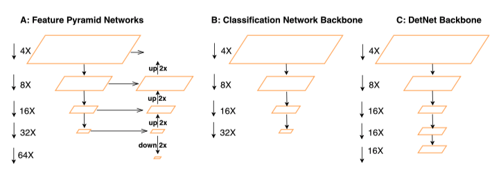

##### 2.1 Motivation

（1）分类和检测任务不同，因此用分类数据上训练的分类模型来提取特征用于检测任务不一定合适，比如检测任务比较关注目标的尺度特征，但是分类任务就不一定了。

（2）检测任务不仅仅要做目标的分类，而且要做目标的定位，这样的差异容易导致一些问题，比如在分类网络中常用的降采样操作可能对分类有效，因为增大了感受野，但是对于需要定位目标的检测任务而言就不一定有利，因为丢失了目标的位置信息。

##### 2.2 contribution

（1）增加网络高层输出特征的分辨率，换句话说就是高层不对特征图做尺寸缩减。

（2）引入dilated卷积层增加网络高层的感受野，这是因为第一个改进点引起的感受野减小。

（3）减小网络高层的宽度，减少因增大分辨率带来的计算量。

##### 2.3 Method

如果网络高层的特征不做像分类网络那样多的降采样（将stride等于32修改为stride等于16）会带来两个问题：

（1）增加计算量。这个很容易理解，毕竟特征图比之前的大，计算量的增加不可避免。

（2）高层的感受野（receptive field）减小。感受野和信息丢失类似跷跷板，既然前面选择了尽可能减少高层的特征信息丢失，那么感受野减小也是情理之中。

那么怎么解决这两个问题呢？

（1）针对问题1，主要是降低了网络高层的宽度，这个在下图D中展示得比较清楚了，高层的几个stage的每个block的输入特征通道都是256。而常见的分类算法中，比如ResNet越往高层的stage，特征通道数往往越大。 
（2）针对问题2，主要引入dilated卷积层来增大感受野，如下图的A和B所示，通过对比ResNet网络的residual block（下图C）可以看出主要是替换了传统的3*3卷积为dilated卷积层。因此下图中的A和B是DetNet网络中的基础结构（下图D所示）。 

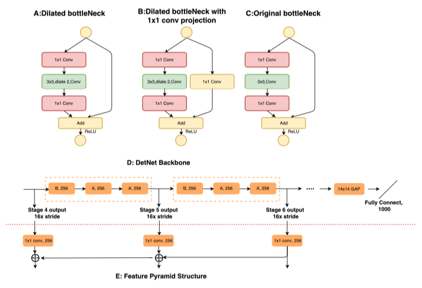

参考资料：[DetNet 算法笔记](https://blog.csdn.net/u014380165/article/details/81582623)

#### 4.Cascade R-CNN

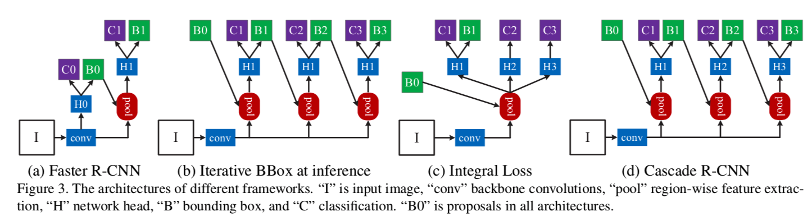

Github:[Pytorch复现](https://link.zhihu.com/?target=https%3A//github.com/guoruoqian/cascade-rcnn_Pytorch)

参考资料：

[Cascade RCNN算法笔记](https://blog.csdn.net/u014380165/article/details/80602027)

[CVPR18 Detection文章选介（上）](https://zhuanlan.zhihu.com/p/35882192)

[目标检测论文阅读：Cascade R-CNN: Delving into High Quality Object Detection](https://zhuanlan.zhihu.com/p/36095768)

[Cascade R-CNN 详细解读](https://zhuanlan.zhihu.com/p/42553957)

#### 5.RefineDet

##### 核心点

SSD+RPN+FPN

（1）引入Two Stage目标检测算法中对Box由粗到细进行回归思想，即先通过RPN网络得到粗粒度的Box信息，然后再通过常规的回归支路进行进一步回归从而得到更加精确的框信息；

（2）引入类似FPN网络的特征融合操作，可以有效提高对小目标的检测效果，检测网络的框架还是SSD。

##### Motivation

两阶段目标检测方法相比单阶段方法有以下三个优势：

（1）两阶段目标检测器采用了两段结构采样来处理类别不均衡的问题
（2）使用了先提取粗粒度Box然后进一步回归，两阶段级联的方式来拟合bbox
（3）采用了两阶段的特征图来描述待检目标

##### Method

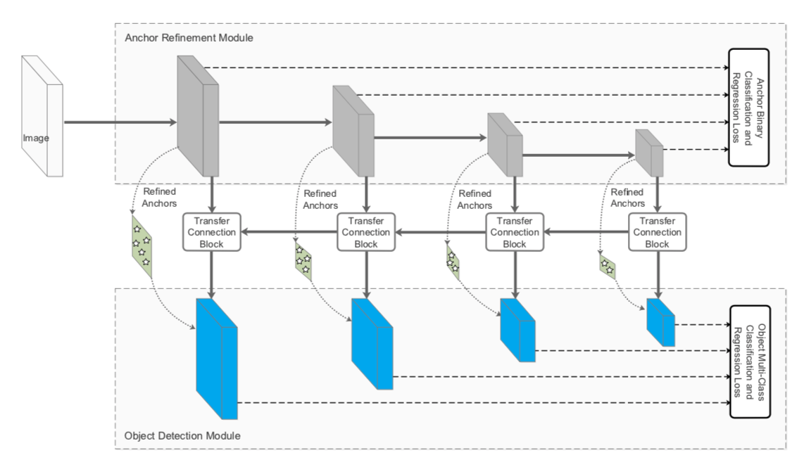

网络结构主要包含ARM、TCB和ODM三部分

（1）ARM（Anchor Refinement Module）

粗筛anchor，剔除掉过于容易的负样本anchors以便为分类器减少搜索空间，降低后续的计算复杂度

粗略调整 anchors 的位置和大小，为ODM提供更好的初始值

（2）TCB（Transfer Connection Block）

将ARM部分输出的Feature Map转换成ODM部分的输入。TCB通过进行特征层的融合，将高语义层上采样（通过反卷积实现）与上一层进行融合，提高底特征层的语义信息。不仅可以传递anchor的信息，也是一种做特征金字塔的方式。

本文作者使用了反卷积和按位加法来完成了TCB的运算。

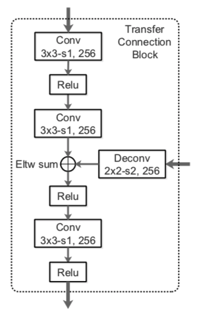

（3）ODM（Object Detection Module）

ODM 旨在根据细化后的 anchors 将结果回归到准确的目标位置并预测多类别标签。不同的地方在于该部分的Anchors是ARM部分得到的Refined Anchors，Feature Map来自TCB得到的融合了各层的多语义Feature Map（可大幅度提高小目标物体的检测效果）。

（4）two-step cascaded regression

作者认为目前的单阶段目标检测器只进行了一次的目标框回归，这可能是导致在一些困难任务上表现不佳的原因

所以，不同于SSD，RefineDet采用了两步的回归策略，首先由ARM生成大致的目标框，再由ODM在次基础上进一步精修目标框边界，作者认为这种方法会提升模型整体的精度，尤其是改进对小目标检测的表现

（5）negative anchor filtering

负样本筛选，本文的思路是ARM将负样本置信度大于门限值 θ 的目标框筛去，θ 的经验值是0.99。也就是说ARM仅将正样本和困难的负样本送进ODM进行进一步检测

困难负样本挖掘采用了与SSD一致的方法，将负：正样本比例保持在3:1

（6）损失函数

RefineDet的损失函数由两部分组成，ACM和ODM，每一部分都包含分类与回归两个损失函数，所以总得损失函数为：

其中i是mini-batch中anchor的index,

 $l_i^*$ 是anchor i ground truth class label.

$g_i^*$ 是i anchor 的ground truth location 和 size.

$p_i$和$x_i$ 是anchor i 的predicted confidence和ARM的refined coordinates.

$c_i$和 $t_i$是 ODM 的predicted object class 和 coordinates of the bounding box. 

$N_{arm}$和$N_{odm}$是ARM和ODM的positive anchor的数目

[l>1]是Iverson bracket indicator function，如果括号里面成立输出1，否则输出零。

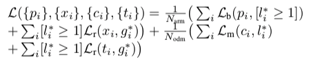

参考资料

[[读论文] Single-Shot Refinement Neural Network for Object Detection](https://zhuanlan.zhihu.com/p/37873666)

[http://www.baiyifan.cn/2019/03/10/RefineDet/](http://www.baiyifan.cn/2019/03/10/RefineDet/)

[https://hellozhaozheng.github.io/z_post/%E8%AE%A1%E7%AE%97%E6%9C%BA%E8%A7%86%E8%A7%89-RefineDet-CVPR2018/](https://hellozhaozheng.github.io/z_post/计算机视觉-RefineDet-CVPR2018/)

[RefineDet算法笔记](https://blog.csdn.net/u014380165/article/details/79502308)

#### 6. Consistent Optimization

《Consistent Optimization for Single-Shot Object Detection》

##### Motivation

单阶段目标检测主要有两个不足，一个是前景-背景类别不平衡，由focal loss处理；另一个是训练目标和推理设置的不一致，本文通过利用训练时refined anchors来解决后者。

不一致具体是：分类的训练目标是对default，regular anchor进行分类，而预测的概率分配给由定位分支产生的对应回归后anchor。

当原始anchor和refined anchor具有相同的groundtruth目标时，这种训练推理配置可以很好地工作。但是在下面两种情况则不然。

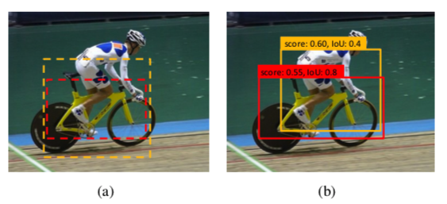

（1）当两个物体相互遮挡时，比如上图，两个anchor都匹配bike，所以检测器把这两个anchor的类别都判定为bike，进行分类和回归后，黄色框回归到类别person，但是其判定的类别是bike，这样不一致可能导致NMS时定位准确的anchor（红框）被错误的框（黄框）抑制。

（2）上图可以发现，回归后输出的IoU一般比输入的IoU要大，所以一些anchor被判定为负样本，但是如果经过回归，有可能是正样本.

所以在训练阶段使用回归后的anchor可以此gap。

##### Consistent Optimization

###### Consistent Detection

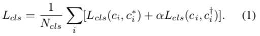

###### Consistent Localization

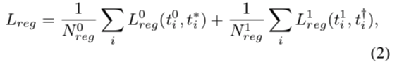

##### Comparison to Prior Works

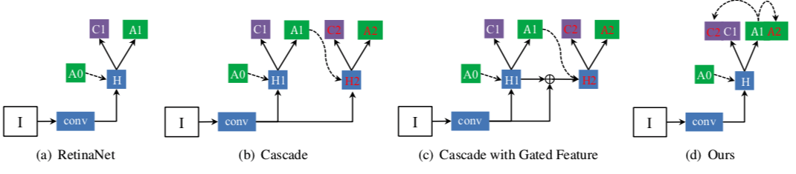

##### Experiments

###### 对比实验

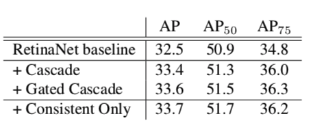

######  正负样本超参数

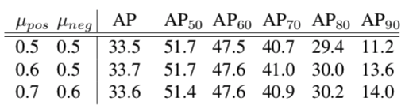

###### 不同数量分类/回归

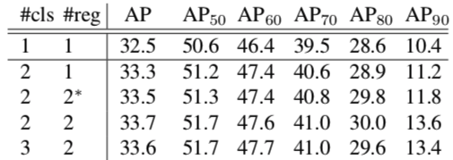

###### 泛化能力

**不同网络深度和输入图片尺度**

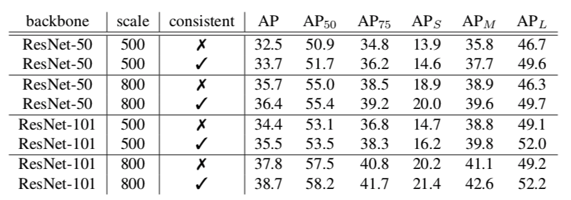

**SSD**

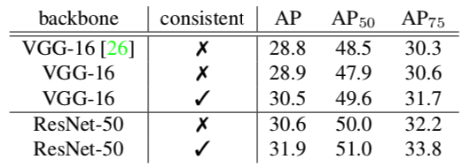

##### 与SOTA比较

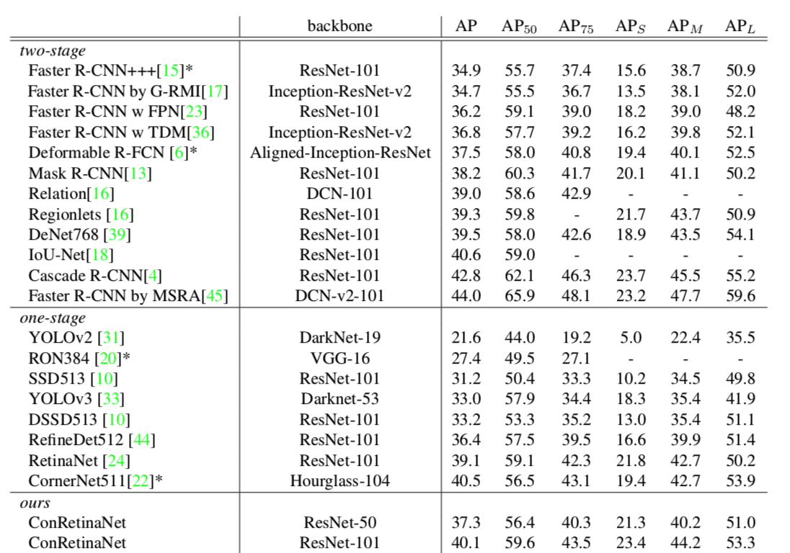

#### 7.Focal Loss

《Focal Loss for Dense Object Detection》

RetinaNet：ResNet+FPN+Focal Loss

##### Motivation

one-stage不如two-stage的主要原因在于正负样本的极度不平衡，一张图像可能生成成千上万的candidate locations，但是其中只有很少一部分是包含object的，这就带来了类别不均衡。

而这种不平衡会导致两个问题：

（1）训练低效，因为大部分位置都是简单负样本，贡献无用的学习信号；

（2）整体而言，简单负样本会在训练中占据压倒性优势，导致模型退化。

OHEM（online hard example mining）：each example is scored by its loss, non-maximum suppression (nms) is then applied, and a minibatch is constructed with the highest-loss examples。

#### 8.Light-Weight RetinaNet

减少FLOPs的两种常用思路：

（1）更换小backbone

（2）减小输入图片尺寸，会指数下降准确率

只减少计算密集层中的FLOPs，而保持其他层不变。可以接近线性。

## 五、Reference

[1]**(YOLOv1)** J. Redmon, S. Divvala, R. Girshick, and A. Farhadi. You only look once: Unified, real-time object detection. In CVPR, 2016.

[2]**(SSD)** W. Liu, D. Anguelov, D. Erhan, C. Szegedy, S. Reed, C.-Y. Fu, and A. C. Berg. SSD: Single shot multibox detector. In ECCV, 2016.

[3]**(DSSD)** C.-Y. Fu, W. Liu, A. Ranga, A. Tyagi, and A. C. Berg. DSSD:Deconvolutional single shot detector. In arXiv,2017.

[4]**(YOLOv2)** J. Redmon and A. Farhadi. YOLO9000: Better, faster, stronger. In CVPR, 2017. 

[5]**(RetinaNet)** T.-Y. Lin, P. Goyal, R. Girshick, K. He, and P. Dollar. Focal loss for dense object detection. In ICCV, 2017. 

[6]**(DSOD)** Shen Z., Liu Z., Li J., Jiang Y., Chen Y., Xue X. DSOD: Learning deeply supervised object detectors from scratch. In ICCV, 2017

[7] **(YOLOv3)** J. Redmon and A. Farhadi. YOLOv3: An incremental im- provement. In arXiv, 2018. 

[8]**(RefineDet)** S. Zhang, L. Wen, X. Bian, Z. Lei, and S. Z. Li. Single-shot refinement neural network for object detection. In CVPR, 2018.

[9]**(RFBNet)** Songtao Liu, Di Huang⋆, and Yunhong Wang. Receptive Field Block Net for Accurate and Fast Object Detection. In ECCV ,2018.

[10]**(M2Det)** Qijie Zhao, Tao Sheng, Yongtao Wang, Zhi Tang, Ying Chen, Ling Cai and Haibin Ling. M2Det: A Single-Shot Object Detector based on Multi-Level Feature Pyramid Network. In AAAI,2019.

[11]**(Consistent Optimization)** Tao Kong,Fuchun Sun,Huaping Liu,Yuning Jiang and Jianbo Shi. Consistent Optimization for Single-Shot Object Detection. In arXiv, 2019.

[12]**(R-CNN)** R. Girshick, J. Donahue, T. Darrell, and J. Malik. Rich feature hierarchies for accurate object detection and semantic segmentation. In CVPR, 2014. 

[13]**(SppNet)** K.He,X.Zhang,S.Ren,andJ.Sun.Spatial pyramid pooling in deep convolutional networks for visual recognition. In ECCV,2014.

[14]**(Fast R-CNN)** R. Girshick. Fast R-CNN. In ICCV, 2015.

[15]**(Faster R-CNN)** S. Ren, K. He, R. Girshick, and J. Sun. Faster R-CNN: Towards real-time object detection with region proposal net-works. In NIPS, 2015.

[16]**(OHEM)** Abhinav Shrivastava,Abhinav Gupta and Ross Girshick. Training Region-based Object Detectors with Online Hard Example Mining.In CVPR, 2016.

[17] **(R-FCN)** J.Dai,Y.Li,K.He,andJ.Sun.R-FCN:Object detection via region-based fully convolutional networks. In NIPS, 2016. 

[18]**(FPN)** T.-Y. Lin, P. Dolla ́r, R. B. Girshick, K. He, B. Hariharan, and S. J. Belongie. Feature pyramid networks for object detection. In CVPR, 2017. 

[19]**(DCN)** J. Dai, H. Qi, Y. Xiong, Y. Li, G. Zhang, H. Hu, and Y. Wei. Deformable convolutional networks. In ICCV, 2017. 

[20]**(Mask R-CNN)** K.He,G.Gkioxari,P.Dolla ́r,and R.Girshick.MaskR-CNN. In ICCV, 2017.

[21]**(Soft- NMS)** N. Bodla, B. Singh, R. Chellappa, and L. S. Davis. Soft-NMS-improving object detection with one line of code. In ICCV, 2017. 

[22]**(Cascade R-CNN)** Z. Cai and N. Vasconcelos. Cascade R-CNN: Delving into high quality object detection. In CVPR, 2018. 

[23]**(IoUNet)** Borui Jiang,Ruixuan Luo,Jiayuan Mao,Tete Xiao,and Yuning Jiang.Acquisition of Localization Confidence for Accurate Object Detection.In ECCV 2018.

[24]**(TridentNet)** Yanghao Li,Yuntao Chen,Naiyan Wang,Zhaoxiang Zhang.Scale-Aware Trident Networks for Object Detection.In arXiv,2019.

[25]**(ResNet)** K. He, X. Zhang, S. Ren, and J. Sun. Deep residual learning for image recognition. In CVPR, 2016.

[26]**(DenseNet)** Gao Huang,Zhuang Liu,Laurens van der Maaten.Densely Connected Convolutional Networks. In CVPR,2017.
